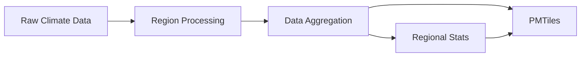

# OCR - Open Climate Risk Platform

| CI          | [![GitHub Workflow Status][github-ci-badge]][github-ci-link] [![Deploy Status][github-deploy-badge]][github-deploy-link] [![E2E Tests][github-e2e-badge]][github-e2e-link] [![Code Coverage Status][codecov-badge]][codecov-link] [![pre-commit.ci status][pre-commit.ci-badge]][pre-commit.ci-link] |
| :---------- | :--------------------------------------------------------------------------------------------------------------------------------------------------------------------------------------------------------------------------------------------------------------------------------------------------: |
| **License** |                                                                                                                                [![License][license-badge]][repo-link]                                                                                                                                |

A scalable pipeline for calculating climate risk assessments at building-level resolution across the continental United States. OCR processes wildfire and wind risk data through a distributed processing system that can run locally or on cloud infrastructure.

## Quick Start

### Installation

> [!IMPORTANT]
> We use [`pixi`](https://pixi.sh/latest/) to manage our development environment, which you'll need to install before you can get started with the project.

```bash
# Clone the repository
git clone https://github.com/carbonplan/ocr.git
cd ocr

# Install dependencies with pixi
pixi install

# Activate the environment
pixi shell
```

### Basic Usage

```bash
# Process fire risk for a single region locally
ocr run --region-id y10_x2 --platform local --risk-type fire

# Process multiple regions on Coiled cloud infrastructure
ocr run --region-id y10_x2 --region-id y11_x3 --platform coiled

# Process all available regions with summary statistics
ocr run --all-region-ids --platform coiled --summary-stats
```

### Configuration

Create a `.env` file with your configuration:

```bash

# OCR Configuration
OCR_STORAGE_ROOT=s3://your-bucket/
OCR_ENVIRONMENT=QA
OCR_DEBUG='1'
```

## Architecture

The OCR pipeline consists of four main stages:

1. **Region Processing** - Calculate risk metrics for individual geographic regions
2. **Data Aggregation** - Combine regional geoparquet files into consolidated datasets
3. **Statistical Summaries** - Generate county and tract-level risk statistics (optional)
4. **Tile Generation** - Create PMTiles for web visualization

### Data Flow



## Command Reference

### Main Commands

- `ocr run` - Full pipeline orchestration
- `ocr process-region` - Process a single region
- `ocr aggregate` - Combine regional data
- `ocr create-pmtiles` - Generate visualization tiles

## Development

### Running Tests

```bash
# Run all tests
pixi run tests

# Run specific test file
pixi run pytest tests/test_datasets.py
```

### Code Quality

```bash
# Format code
pixi run format

# Run linting
pixi run lint
```

### Local Development Workflow

```bash
# 1. Test single region processing
ocr process-region y10_x2 --risk-type fire

# 2. Run minimal pipeline locally
ocr run --region-id y10_x2 --platform local

# 3. Generate tiles from existing data
ocr create-pmtiles
```

### Developer Guide

This short guide collects common developer tasks and tips for working on OCR.

### Environment files

- The project uses dotenv-style env files. Example files in the repo include `ocr-local.env` and `ocr-coiled-s3.env` — copy one of these to `.env` and edit values as needed.
- Important environment variables:
  - `OCR_STORAGE_ROOT` — S3 path or local path where output is written (e.g. `s3://your-bucket/`).
  - `OCR_ENVIRONMENT` — name of the environment (e.g. `DEV`, `QA`, `PROD`).
  - `OCR_DEBUG` — set to `1` to enable more verbose logging for local troubleshooting.

### Recommended developer workflow

- Start a dev shell with the project environment (we use `pixi`):

```bash
pixi shell
```

- Debugging & logging
  - To enable verbose logs set `OCR_DEBUG='1'` in your `.env` or export it before running commands.
  - For quick troubleshooting you can run a single region with `OCR_DEBUG=1 ocr process-region ...` from your shell.
- Tests
  - Run the full test suite with `pixi run tests` or run a specific file with `pixi run pytest tests/test_datasets.py`.
  - When adding tests, aim for one happy-path unit test plus one edge-case test (null/empty input or invalid region id).
- Continuous integration / pre-commit
  - The repository is configured to run tests and checks on CI. Use the pre-commit hooks locally to avoid CI failures: the CI status badges are shown at the top of this README.

## Deployment

### GitHub Actions

The repository includes automated workflows for:

- **CI/CD** - Run tests and quality checks on every PR
- **Deployment** - Process regions via manual workflow dispatch
- **Integration Tests** - End-to-end pipeline validation

### Manual Deployment

```bash
# Production deployment on Coiled
ocr run
  --all-region-ids
  --platform coiled
  --summary-stats
  --env-file production.env
```

## Data Products

OCR generates several data products:

- **Regional Geoparquet** - Building-level risk scores by region
- **Consolidated Dataset** - Combined data across all regions
- **Regional Statistics** - County and tract-level aggregations
- **PMTiles** - Vector tiles for web visualization

## Contributing

We welcome contributions! Please see our [contributing guide](./contributing.md) for detailed instructions on:

- Setting up your development environment
- Running tests and quality checks
- Submitting pull requests
- Code style and standards

## Support

- **Documentation** - [Full documentation](https://carbonplan-ocr.readthedocs.io) (coming soon)
- **Issues** - Report bugs or request features via [GitHub Issues](https://github.com/carbonplan/ocr/issues)
- **Discussions** - Join the conversation in [GitHub Discussions](https://github.com/carbonplan/ocr/discussions)

## License

This project is licensed under the MIT License - see the [LICENSE](LICENSE) file for details.

[github-ci-badge]: https://github.com/carbonplan/ocr/actions/workflows/ci.yaml/badge.svg
[github-ci-link]: https://github.com/carbonplan/ocr/actions/workflows/ci.yaml
[github-deploy-badge]: https://github.com/carbonplan/ocr/actions/workflows/deploy.yaml/badge.svg
[github-deploy-link]: https://github.com/carbonplan/ocr/actions/workflows/deploy.yaml
[github-e2e-badge]: https://github.com/carbonplan/ocr/actions/workflows/integration-tests.yaml/badge.svg
[github-e2e-link]: https://github.com/carbonplan/ocr/actions/workflows/integration-tests.yaml
[codecov-badge]: https://img.shields.io/codecov/c/github/carbonplan/ocr.svg?logo=codecov
[codecov-link]: https://codecov.io/gh/carbonplan/ocr
[license-badge]: https://img.shields.io/github/license/carbonplan/ocr
[repo-link]: https://github.com/carbonplan/ocr
[pre-commit.ci-badge]: https://results.pre-commit.ci/badge/github/carbonplan/ocr/main.svg
[pre-commit.ci-link]: https://results.pre-commit.ci/latest/github/carbonplan/ocr/main
