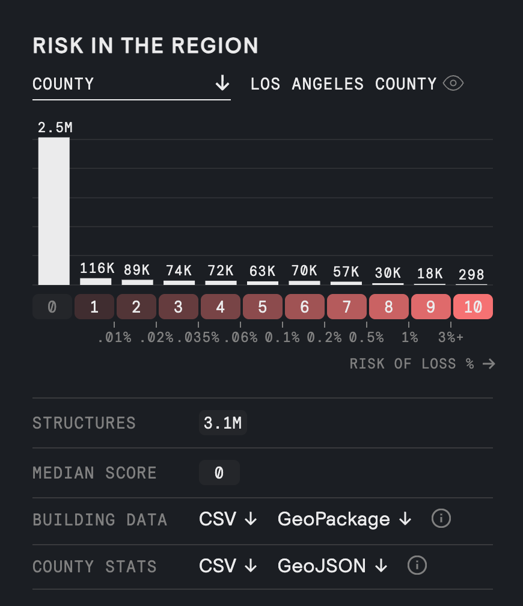

# Data Downloads (Beta)

While OCR is in beta, there a few different ways to access the data, in addition to exploration via the web tool. This page outlines the different versions and formats of data available for download.

<!-- prettier-ignore-start -->
!!! warning "License Agreement"
    Open Climate Risk data are made available under the licenses listed below. By accessing the data, you agree to adhere to the license terms.

<!-- prettier-ignore-end -->

<!-- prettier-ignore-start -->
!!! warning "Terms of Data Use"
    By viewing Open Climate Risk data, you agree to the [Terms of Data Access](terms-of-data-access.md).

<!-- prettier-ignore-end -->

## Download options

| Option                            | Description                                                                             | Formats               | Access                                                       | License                                                   | Data sources                                                                                                                                                                                                                                                                                                                                                                                                 |
| --------------------------------- | --------------------------------------------------------------------------------------- | --------------------- | ------------------------------------------------------------ | --------------------------------------------------------- | ------------------------------------------------------------------------------------------------------------------------------------------------------------------------------------------------------------------------------------------------------------------------------------------------------------------------------------------------------------------------------------------------------------ |
| **Raster (tensor) data**          | Full gridded dataset spanning CONUS                                                     | Icechunk (Zarr-based) | [Source Coop](https://source.coop/carbonplan/carbonplan-ocr) | [CC BY 4.0](https://creativecommons.org/licenses/by/4.0/) | [K Riley et al. 2025](https://doi.org/10.2737/RDS-2025-0006), [J Scott et al. 2024](https://doi.org/10.2737/RDS-2020-0016-2), [R Rasmussen et al. 2023](https://doi.org/10.1175/BAMS-D-21-0326.1)                                                                                                                                                                                                            |
| **Vector (point) data**           | Full buildings dataset spanning CONUS                                                   | GeoParquet            | [Source Coop](https://source.coop/carbonplan/carbonplan-ocr) | [ODbL](https://opendatacommons.org/licenses/odbl/1-0/)    | [Overture Maps Foundation buildings dataset](https://docs.overturemaps.org/guides/buildings/), [K Riley et al. 2025](https://doi.org/10.2737/RDS-2025-0006), [J Scott et al. 2024](https://doi.org/10.2737/RDS-2020-0016-2), [R Rasmussen et al. 2023](https://doi.org/10.1175/BAMS-D-21-0326.1)                                                                                                             |
| **Regional statistics**           | Summary statistics for regions (state, county, census tract, census block) within CONUS | CSV, GeoJSON          | [Source Coop](https://source.coop/carbonplan/carbonplan-ocr) | [ODbL](https://opendatacommons.org/licenses/odbl/1-0/)    | [Census TIGER/Line](https://www.census.gov/geographies/mapping-files/time-series/geo/tiger-line-file.html), [Overture Maps Foundation buildings dataset](https://docs.overturemaps.org/guides/buildings/), [K Riley et al. 2025](https://doi.org/10.2737/RDS-2025-0006), [J Scott et al. 2024](https://doi.org/10.2737/RDS-2020-0016-2), [R Rasmussen et al. 2023](https://doi.org/10.1175/BAMS-D-21-0326.1) |
| **Subsetted vector (point) data** | Building-level data subsetted to active region (county, census tract, census block)     | CSV, GeoPackage       | Web tool (see below)                                         | [ODbL](https://opendatacommons.org/licenses/odbl/1-0/)    | [Census TIGER/Line](https://www.census.gov/geographies/mapping-files/time-series/geo/tiger-line-file.html), [Overture Maps Foundation buildings dataset](https://docs.overturemaps.org/guides/buildings/), [K Riley et al. 2025](https://doi.org/10.2737/RDS-2025-0006), [J Scott et al. 2024](https://doi.org/10.2737/RDS-2020-0016-2), [R Rasmussen et al. 2023](https://doi.org/10.1175/BAMS-D-21-0326.1) |

## Full dataset downloads

### Links

| Option                   | Path                                                                                                                                    | Notes                                                                       |
| ------------------------ | --------------------------------------------------------------------------------------------------------------------------------------- | --------------------------------------------------------------------------- |
| **Raster (tensor) data** | `s3://us-west-2.opendata.source.coop/carbonplan/carbonplan-ocr/output/fire-risk/tensor/production/v0.13.1/ocr.icechunk/`                | See [guide for working with Icehunk data](./how-to/work-with-data.ipynb)    |
| **Vector (point) data**  | `s3://us-west-2.opendata.source.coop/carbonplan/carbonplan-ocr/output/fire-risk/vector/production/v0.13.1/geoparquet/buildings.parquet` | See [guide for working with GeoParquet data](./how-to/work-with-data.ipynb) |

### Schema

The schemas for each of the full datasets are described on the [data schema](./reference/data-schema.md) page.

## Regional statistics downloads

### Links

|                                             | CSV                                                                                                                                                                                      | GeoJSON                                                                                                                                                                                          |
| ------------------------------------------- | ---------------------------------------------------------------------------------------------------------------------------------------------------------------------------------------- | ------------------------------------------------------------------------------------------------------------------------------------------------------------------------------------------------ |
| Statistics by **county** across CONUS       | [`stats.csv`](https://s3.us-west-2.amazonaws.com/us-west-2.opendata.source.coop/carbonplan/carbonplan-ocr/output/fire-risk/vector/production/v0.13.1/region-analysis/counties/stats.csv) | [`stats.geojson`](https://s3.us-west-2.amazonaws.com/us-west-2.opendata.source.coop/carbonplan/carbonplan-ocr/output/fire-risk/vector/production/v0.13.1/region-analysis/counties/stats.geojson) |
| Statistics by **census tract** across CONUS | [`stats.csv`](https://s3.us-west-2.amazonaws.com/us-west-2.opendata.source.coop/carbonplan/carbonplan-ocr/output/fire-risk/vector/production/v0.13.1/region-analysis/tracts/stats.csv)   | [`stats.geojson`](https://s3.us-west-2.amazonaws.com/us-west-2.opendata.source.coop/carbonplan/carbonplan-ocr/output/fire-risk/vector/production/v0.13.1/region-analysis/tracts/stats.geojson)   |
| Statistics by **census block** across CONUS | [`stats.csv`](https://s3.us-west-2.amazonaws.com/us-west-2.opendata.source.coop/carbonplan/carbonplan-ocr/output/fire-risk/vector/production/v0.13.1/region-analysis/block/stats.csv)    | [`stats.geojson`](https://s3.us-west-2.amazonaws.com/us-west-2.opendata.source.coop/carbonplan/carbonplan-ocr/output/fire-risk/vector/production/v0.13.1/region-analysis/block/stats.geojson)    |
| Statistics by **state** across CONUS        | [`stats.csv`](https://s3.us-west-2.amazonaws.com/us-west-2.opendata.source.coop/carbonplan/carbonplan-ocr/output/fire-risk/vector/production/v0.13.1/region-analysis/states/stats.csv)   | [`stats.geojson`](https://s3.us-west-2.amazonaws.com/us-west-2.opendata.source.coop/carbonplan/carbonplan-ocr/output/fire-risk/vector/production/v0.13.1/region-analysis/states/stats.geojson)   |
| Summary statistics across **CONUS**         | [`stats.csv`](https://s3.us-west-2.amazonaws.com/us-west-2.opendata.source.coop/carbonplan/carbonplan-ocr/output/fire-risk/vector/production/v0.13.1/region-analysis/nation/stats.csv)   | [`stats.geojson`](https://s3.us-west-2.amazonaws.com/us-west-2.opendata.source.coop/carbonplan/carbonplan-ocr/output/fire-risk/vector/production/v0.13.1/region-analysis/nation/stats.geojson)   |

### Schema

| Variable               | Type    | Description                                                                                                                                                                                                                        |
| ---------------------- | ------- | ---------------------------------------------------------------------------------------------------------------------------------------------------------------------------------------------------------------------------------- |
| **Region identifiers** |         | _Identifying information for region--a state, county, census tract, or census block--represented in each row_                                                                                                                      |
| `GEOID`                | int     | [Geographic Identifier](https://www.census.gov/programs-surveys/geography/guidance/geo-identifiers.html) for region                                                                                                                |
| `building_count`       | int     | Total number of buildings in region                                                                                                                                                                                                |
| `longitude`            | degrees | Longitude of centroid of region                                                                                                                                                                                                    |
| `latitude`             | degrees | Latitude of centroid of region                                                                                                                                                                                                     |
| **Risk values**        |         | _Risk values from output, input, or comparison datasets_                                                                                                                                                                           |
| `rps_2011_mean`        | float   | Mean annual fire risk (~2011 climate conditions) across all buildings in region                                                                                                                                                    |
| `rps_2047_mean`        | float   | Mean annual fire risk (~2047 climate conditions) across all buildings in region                                                                                                                                                    |
| `bp_2011_mean`         | float   | Mean burn probability (~2011 climate conditions) across all buildings in region                                                                                                                                                    |
| `bp_2047_mean`         | float   | Mean burn probability (~2047 climate conditions) across all buildings in region                                                                                                                                                    |
| `crps_scott_mean`      | float   | Mean conditional risk to potential structures (cRPS) from Scott et al., (2024)(2024)                                                                                                                                               |
| `bp_2011_riley_mean`   | float   | Mean burn probability (~2011 climate conditions) across all buildings in region from Riley et al., (2025)                                                                                                                          |
| `bp_2047_riley_mean`   | float   | Mean burn probability (~2047 climate conditions) across all buildings in region from Riley et al., (2025)                                                                                                                          |
| `rps_2011_median`      | float   | Median annual fire risk (~2011 climate conditions) across all buildings in region                                                                                                                                                  |
| `rps_2047_median`      | float   | Median annual fire risk (~2047 climate conditions) across all buildings in region                                                                                                                                                  |
| `bp_2011_median`       | float   | Median burn probability (~2011 climate conditions) across all buildings in region                                                                                                                                                  |
| `bp_2047_median`       | float   | Median burn probability (~2047 climate conditions) across all buildings in region                                                                                                                                                  |
| `crps_scott_median`    | float   | Median conditional risk to potential structures from Scott et al., (2024)                                                                                                                                                          |
| `bp_2011_riley_median` | float   | Median burn probability (~2011 climate conditions) across all buildings in region from Riley et al. (2025)                                                                                                                         |
| `bp_2047_riley_median` | float   | Median burn probability (~2047 climate conditions) across all buildings in region from Riley et al. (2025)                                                                                                                         |
| **Histogram values**   |         | _Index in array corresponds to integer risk score (e.g., first value reflects number buildings with `0` score, next value reflects number buildings with `1` score, final value reflects number buildings with `10` score, etc.)._ |
| `risk_score_2011_hist` | float[] | Count of buildings with each risk score (~2011 climate conditions).                                                                                                                                                                |
| `risk_score_2047_hist` | float[] | Count of buildings with each risk score (~2047 climate conditions).                                                                                                                                                                |

## Downloading subsetted data in the web tool

The [web tool](https://ocr.carbonplan.org/) can be used to access region-specific, subsetted downloads.

### Steps

1. Using the map or search bar, navigate to region of interest.
2. Scroll to the `Risk in the region` section in the sidebar.
3. Select your region of interest (county, census tract, or census block) and view trends inline.
4. Click `CSV ↓` or `GeoPackage ↓` to download building-level data for the selected region.

### Schema

| Variable                 | Type    | Description                                                                                                                                                                        |
| ------------------------ | ------- | ---------------------------------------------------------------------------------------------------------------------------------------------------------------------------------- |
| **Building identifiers** |         |                                                                                                                                                                                    |
| `GEOID`                  | int     | [Geographic Identifier](https://www.census.gov/programs-surveys/geography/guidance/geo-identifiers.html) representing building (multiple buildings might belong to the same GEOID) |
| `longitude`              | degrees | Longitude of building centroid                                                                                                                                                     |
| `latitude`               | degrees | Latitude of building centroid                                                                                                                                                      |
| **Risk values**          |         |                                                                                                                                                                                    |
| `rps_2011`               | float   | Annual fire risk (~2011 climate conditions)                                                                                                                                        |
| `rps_2047`               | float   | Annual fire risk (~2047 climate conditions)                                                                                                                                        |
| `bp_2011`                | float   | Annual burn probability (~2011 climate conditions)                                                                                                                                 |
| `bp_2047`                | float   | Annual burn probability (~2047 climate conditions)                                                                                                                                 |
| `crps_scott`             | float   | Conditional risk to potential structures (cRPS) from Scott et al., (2024)                                                                                                          |
| `bp_2011_riley`          | float   | Annual burn probability (~2011 climate conditions) from Riley et al., (2025)                                                                                                       |
| `bp_2047_riley`          | float   | Annual burn probability (~2047 climate conditions) from Riley et al., (2025)                                                                                                       |
