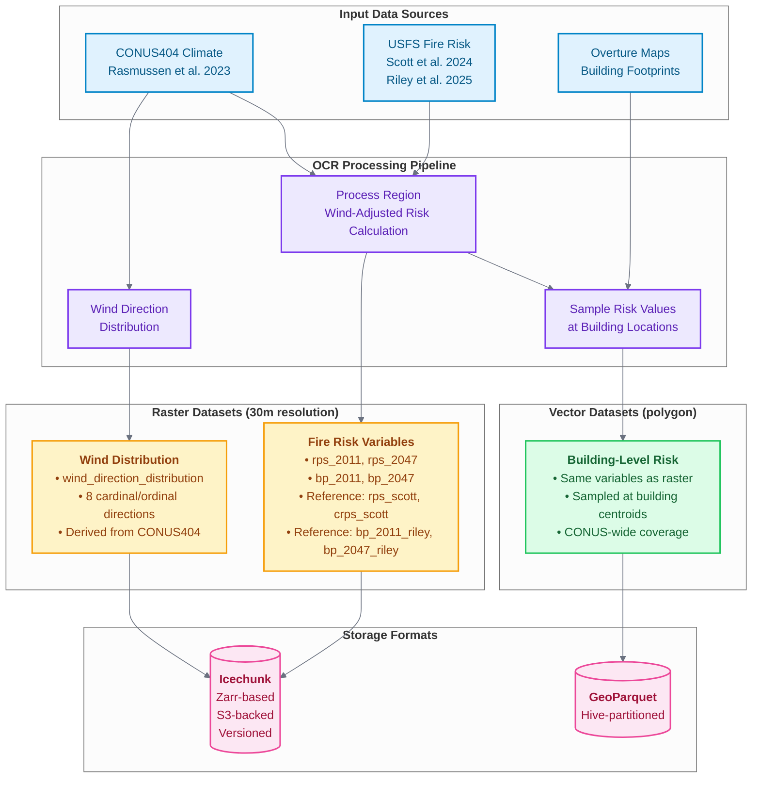
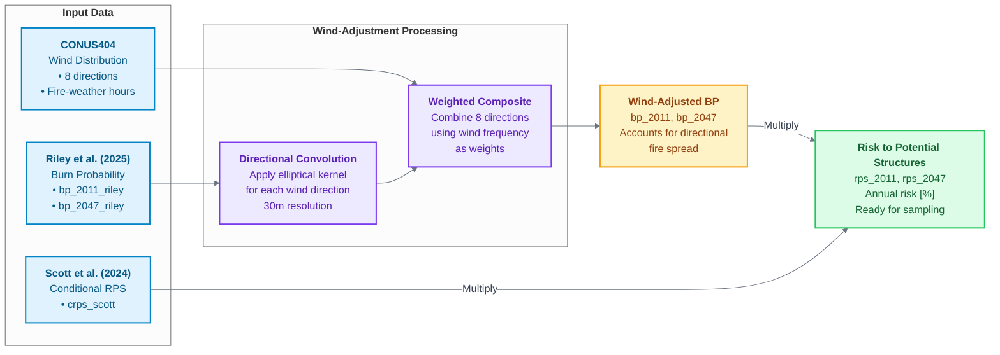

# Data Schema

Open Climate Risk (OCR) produces two primary types of output data: **raster (tensor) datasets** and **vector (polygon) datasets**. This page documents the structure, variables, and schema of both output types.

## Overview



## Raster (Tensor) Datasets

Raster datasets are gridded geospatial layers stored at 30m resolution in EPSG:4326 (WGS84) projection. These datasets are organized by region and stored in the Icechunk format.

### Spatial Characteristics

| Property           | Value                  |
| ------------------ | ---------------------- |
| **Resolution**     | 30m (~0.00028 degrees) |
| **Projection**     | EPSG:4326 (WGS84)      |
| **Extent**         | CONUS                  |
| **Chunking**       | Regional chunks        |
| **Storage Format** | Icechunk (Zarr-based)  |

### Fire Risk Variables

The primary output dataset contains the following variables. To support transparency we also include previously published datasests we used as inputs or for comparison. For clarity, we append a `variable_{name}` modifier to any variable name describing previously-published data. We are the authors of any data without a `_{name}` modifier.

#### Core Risk Variables

| Variable   | Type    | Units         | Description                                                                                                           |
| ---------- | ------- | ------------- | --------------------------------------------------------------------------------------------------------------------- |
| `rps_2011` | float32 | %             | Annual relative risk to potential structures (RPS) for ~2011 climate conditions. Calculated as `bp_2011 × crps_scott` |
| `rps_2047` | float32 | %             | Annual risk to potential structures (RPS) for ~2047 climate conditions. Calculated as `bp_2047 × crps_scott`          |
| `bp_2011`  | float32 | dimensionless | Annual burn probability for ~2011 climate conditions                                                                  |
| `bp_2047`  | float32 | dimensionless | Annual burn probability for ~2047 climate conditions                                                                  |

#### Reference Variables (Data from USFS and Wildfire Risk to Communities project)

| Variable        | Type    | Units         | Description                                                               |
| --------------- | ------- | ------------- | ------------------------------------------------------------------------- |
| `rps_scott`     | float32 | %             | Annual risk to potential structures from Scott et al., (2024)             |
| `crps_scott`    | float32 | %             | Conditional risk to potential structures (cRPS) from Scott et al., (2024) |
| `bp_2011_riley` | float32 | dimensionless | Burn probability for ~2011 from Riley et al. (2025) (RDS-2025-0006)       |
| `bp_2047_riley` | float32 | dimensionless | Burn probability for ~2047 from Riley et al. (2025)                       |

#### Coordinate Variables

| Variable    | Type    | Description                          |
| ----------- | ------- | ------------------------------------ |
| `latitude`  | float64 | Latitude in decimal degrees (WGS84)  |
| `longitude` | float64 | Longitude in decimal degrees (WGS84) |

### Wind Direction Distribution Dataset

A separate dataset provides the statistical distribution of wind directions during fire-weather conditions:

| Variable                      | Type    | Dimensions                            | Description                                                                                                            |
| ----------------------------- | ------- | ------------------------------------- | ---------------------------------------------------------------------------------------------------------------------- |
| `wind_direction_distribution` | float32 | (latitude, longitude, wind_direction) | Fraction of fire-weather hours coming from each of 8 cardinal/ordinal directions derived from Rasmussen et al., (2023) |

**Wind Direction Dimension:**
The `wind_direction` coordinate contains 8 direction labels: `['N', 'NE', 'E', 'SE', 'S', 'SW', 'W', 'NW']`

**Properties:**

- Values sum to 1.0 for all pixels (normalized probability distribution)
- Derived from CONUS404 data (Rasmussen et al, 2023) using 99th percentile Fosberg Fire Weather Index (FFWI) as threshold

### Data Processing Flow



## Vector (Polygon) Datasets

Vector datasets contain building-level risk samples stored as a consolidated GeoParquet file covering all buildings across CONUS.

### Schema

#### Geometry Column

| Column     | Type          | Description                            |
| ---------- | ------------- | -------------------------------------- |
| `geometry` | WKB (Polygon) | Building polygon location in EPSG:4326 |

#### Risk Attribute Columns

Vector datasets contain the same risk variables as raster datasets, sampled at each building location:

| Column          | Type    | Description                                                                        |
| --------------- | ------- | ---------------------------------------------------------------------------------- |
| `rps_2011`      | float32 | Annual risk to potential structures for ~2011 at building location                 |
| `rps_2047`      | float32 | Annual risk to potential structures for ~2047 at building location                 |
| `bp_2011`       | float32 | Annual burn probability for ~2011 at building location                             |
| `bp_2047`       | float32 | Annual burn probability for ~2047 at building location                             |
| `rps_scott`     | float32 | Annual risk to potential structures (Scott et al., 2024) at building location      |
| `crps_scott`    | float32 | Conditional risk to potential structures (Scott et al., 2024) at building location |
| `bp_2011_riley` | float32 | Annual burn probability ~2011 (Riley et al, 2025) at building location             |
| `bp_2047_riley` | float32 | Annual burn probability ~2047 (Riley et al, 2025) at building location             |

### Storage Characteristics

| Property              | Value                                            |
| --------------------- | ------------------------------------------------ |
| **Format**            | GeoParquet (schema version 1.1.0)                |
| **Compression**       | zstd                                             |
| **Geometry Encoding** | WKB                                              |
| **Spatial Index**     | Covering bounding box (bbox)                     |
| **Coverage**          | CONUS-wide, single consolidated file             |
| **Aggregation**       | Consolidated from regional processing via DuckDB |

### Data Quality

- Buildings with NaN values (outside CONUS) are excluded
- Building locations sourced from Overture Maps dataset

### File Location

The consolidated building dataset is available at:

```text
{building_geoparquet_uri}
```

This single-file format enables:

- Efficient CONUS-wide spatial queries
- Direct access for analysis tools and workflows
- Simplified data distribution and versioning

## Data Validation

### Expected Value Ranges

| Variable                                        | Expected Range | Notes                                                                                            |
| ----------------------------------------------- | -------------- | ------------------------------------------------------------------------------------------------ |
| Risk to potential structures (RPS)              | [0, 100]       | Annual risk of loss [%] to potential structures. Product of BP and cRPS.                         |
| Conditional risk to potential structures (cRPS) | [0, 100]       | Risk of loss [%] to a hypothetical structure if it were to burn                                  |
| Burn probability (BP)                           | [0, 1]         | Annual likelihood [-] of a pixel burning                                                         |
| Wind Distribution                               | [0, 1]         | Sums to 1.0 per pixel (normalized probability distribution across 8 cardinal/ordinal directions) |

### Quality Checks

1. **Spatial Consistency**: All raster layers share identical coordinate systems and extents
2. **Missing Data**: NaN values appear only in unburnable areas (water, urban, etc.)

3. **Normalization**: Wind direction distributions sum to 1.0 (within tolerance of 1e-5) where valid

## Metadata Attributes

All datasets include descriptive metadata attributes:

- `description`: Human-readable description of the variable
- `long_name`: Extended variable name
- `units`: Physical units (if applicable)
- `composition`: Method used for compositing (e.g., "weighted")
- `direction_labels`: Cardinal/ordinal direction labels for wind data
- `weights_source`: Source of weights used in calculations

## Access Patterns

### Raster Data

- **By Region**: Query specific regional chunks using latitude/longitude slices
- **Full CONUS**: Access complete dataset via Icechunk storage

### Vector Data

- **Full Dataset**: Query the consolidated CONUS-wide building dataset
- **Spatial Query**: Use bounding box attributes for efficient spatial filtering
- **Attribute Query**: Filter by risk threshold using Parquet predicate pushdown with DuckDB or similar tools
- **Regional Subset**: Extract specific areas using spatial predicates on latitude/longitude

## Related Documentation

- [Data Downloads](../access-data.md): Information on accessing and downloading datasets
- [Deployment](deployment.md): Details on data storage infrastructure
