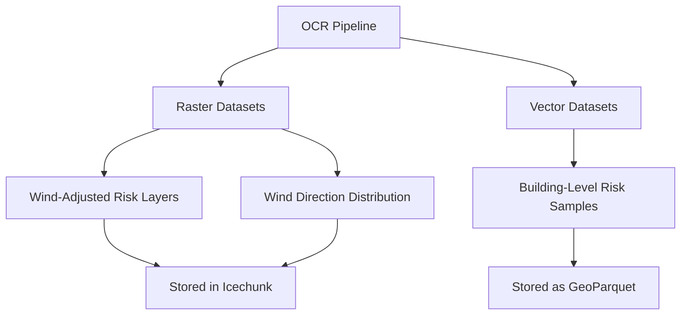
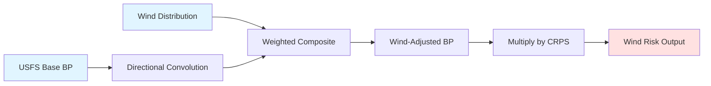

# Data Schema

OCR produces two primary types of output data: **raster (tensor) datasets** and **vector (point) datasets**. This page documents the structure, variables, and schema of both output types.

## Overview



## Raster (Tensor) Datasets

Raster datasets are gridded geospatial layers stored at 30m resolution in EPSG:4326 (WGS84) projection. These datasets are organized by region and stored in the Icechunk format.

### Spatial Characteristics

| Property           | Value                          |
| ------------------ | ------------------------------ |
| **Resolution**     | 30m (~0.0002778 degrees)       |
| **Projection**     | EPSG:4326 (WGS84)              |
| **Extent**         | CONUS                          |
| **Chunking**       | Regional chunks (configurable) |
| **Storage Format** | Icechunk (Zarr-based)          |

### Wind-Adjusted Fire Risk Variables

The primary output dataset contains the following variables:

#### Core Risk Variables

| Variable                | Type    | Units         | Description                                                                                                       |
| ----------------------- | ------- | ------------- | ----------------------------------------------------------------------------------------------------------------- |
| `wind_risk_2011`        | float32 | dimensionless | Wind-informed relative risk score (RPS) for 2011 climate conditions. Calculated as `burn_probability_2011 × CRPS` |
| `wind_risk_2047`        | float32 | dimensionless | Wind-informed relative risk score (RPS) for 2047 climate conditions. Calculated as `burn_probability_2047 × CRPS` |
| `burn_probability_2011` | float32 | dimensionless | Wind-adjusted burn probability for 2011 climate conditions, incorporating directional fire spread                 |
| `burn_probability_2047` | float32 | dimensionless | Wind-adjusted burn probability for 2047 climate conditions, incorporating directional fire spread                 |

#### Reference Variables (USFS Data)

| Variable                     | Type    | Units         | Description                                                                            |
| ---------------------------- | ------- | ------------- | -------------------------------------------------------------------------------------- |
| `USFS_RPS`                   | float32 | dimensionless | Original USFS Relative Risk Score from Scott (2024) baseline dataset (RDS-2020-0016-2) |
| `conditional_risk_usfs`      | float32 | dimensionless | USFS Conditional Risk to Potential Structures (CRPS) from Scott (2024)                 |
| `burn_probability_usfs_2011` | float32 | dimensionless | Original USFS burn probability for 2011 from Riley et al. (2025) (RDS-2025-0006)       |
| `burn_probability_usfs_2047` | float32 | dimensionless | Original USFS burn probability for 2047 from Riley et al. (2025) (RDS-2025-0006)       |

#### Coordinate Variables

| Variable    | Type    | Description                          |
| ----------- | ------- | ------------------------------------ |
| `latitude`  | float64 | Latitude in decimal degrees (WGS84)  |
| `longitude` | float64 | Longitude in decimal degrees (WGS84) |

### Wind Direction Distribution Dataset

A separate dataset provides the statistical distribution of wind directions during fire-weather conditions:

| Variable                      | Type    | Dimensions                            | Description                                                             |
| ----------------------------- | ------- | ------------------------------------- | ----------------------------------------------------------------------- |
| `wind_direction_distribution` | float32 | (latitude, longitude, wind_direction) | Fraction of fire-weather hours in each of 8 cardinal/ordinal directions |

**Wind Direction Dimension:**
The `wind_direction` coordinate contains 8 direction labels: `['N', 'NE', 'E', 'SE', 'S', 'SW', 'W', 'NW']`

**Properties:**

-   Values sum to 1.0 for pixels with fire-weather hours
-   Values are 0 for pixels with no fire-weather hours
-   Derived from CONUS404 data using 99th percentile Fosberg Fire Weather Index (FFWI) as threshold

### Data Processing Flow



## Vector (Point) Datasets

Vector datasets contain building-level risk samples stored as a consolidated GeoParquet file covering all buildings across CONUS.

### Schema

#### Geometry Column

| Column     | Type        | Description                          |
| ---------- | ----------- | ------------------------------------ |
| `geometry` | WKB (POINT) | Building point location in EPSG:4326 |

#### Risk Attribute Columns

Vector datasets contain the same risk variables as raster datasets, sampled at each building location:

| Column                       | Type    | Description                                                  |
| ---------------------------- | ------- | ------------------------------------------------------------ |
| `wind_risk_2011`             | float32 | Wind-informed RPS for 2011 at building location              |
| `wind_risk_2047`             | float32 | Wind-informed RPS for 2047 at building location              |
| `burn_probability_2011`      | float32 | Wind-adjusted burn probability for 2011 at building location |
| `burn_probability_2047`      | float32 | Wind-adjusted burn probability for 2047 at building location |
| `USFS_RPS`                   | float32 | Original USFS RPS at building location                       |
| `conditional_risk_usfs`      | float32 | USFS CRPS at building location                               |
| `burn_probability_usfs_2011` | float32 | Original USFS BP (2011) at building location                 |
| `burn_probability_usfs_2047` | float32 | Original USFS BP (2047) at building location                 |

### Storage Characteristics

| Property              | Value                                            |
| --------------------- | ------------------------------------------------ |
| **Format**            | GeoParquet (schema version 1.1.0)                |
| **Compression**       | zstd                                             |
| **Geometry Encoding** | WKB                                              |
| **Spatial Index**     | Covering bounding box (bbox)                     |
| **Coverage**          | CONUS-wide, single consolidated file             |
| **Aggregation**       | Consolidated from regional processing via DuckDB |

### Data Quality

-   Buildings with NaN values (outside CONUS or unburnable areas) are excluded
-   Risk values < 0.01 are trimmed to 0 to match frontend binning
-   Building locations sourced from Overture Maps dataset

### File Location

The consolidated building dataset is available at:

```text
{building_geoparquet_uri}
```

This single-file format enables:

-   Efficient CONUS-wide spatial queries
-   Direct access for analysis tools and workflows
-   Simplified data distribution and versioning

## Data Validation

### Expected Value Ranges

| Variable                                        | Expected Range | Notes                              |
| ----------------------------------------------- | -------------- | ---------------------------------- |
| Risk to potential structures (RPS)              | [0, 100]       | Product of BP and cRPS. Annual expected relative risk of loss.        |
| Burn probability (BP)                           | [0, 1]         | Annual likelihood of a pixel burning.                                 |
| Conditional risk to potential structures (cRPS) | [0, 100]       | Potential consequences to a hypothetical structure in a particular location if the pixel were to burn.                                  |

### Quality Checks

1. **Spatial Consistency**: All raster layers share identical coordinate systems and extents
2. **Missing Data**: NaN values appear only in:

    - Unburnable areas (water, urban, etc.)
    - Regions with no fire-weather hours (for wind distributions)

3. **Normalization**: Wind direction distributions sum to 1.0 (within tolerance of 1e-5) where valid

## Metadata Attributes

All datasets include descriptive metadata attributes:

-   `description`: Human-readable description of the variable
-   `long_name`: Extended variable name
-   `units`: Physical units (if applicable)
-   `composition`: Method used for compositing (e.g., "weighted")
-   `direction_labels`: Cardinal/ordinal direction labels for wind data
-   `weights_source`: Source of weights used in calculations

## Access Patterns

### Raster Data

-   **By Region**: Query specific regional chunks using latitude/longitude slices
-   **Full CONUS**: Access complete dataset via Icechunk storage

### Vector Data

-   **Full Dataset**: Query the consolidated CONUS-wide building dataset
-   **Spatial Query**: Use bounding box attributes for efficient spatial filtering
-   **Attribute Query**: Filter by risk threshold using Parquet predicate pushdown with DuckDB or similar tools
-   **Regional Subset**: Extract specific areas using spatial predicates on latitude/longitude

## Related Documentation

-   [Data Downloads](../access-data.md): Information on accessing and downloading datasets
-   [Deployment](deployment.md): Details on data storage infrastructure
