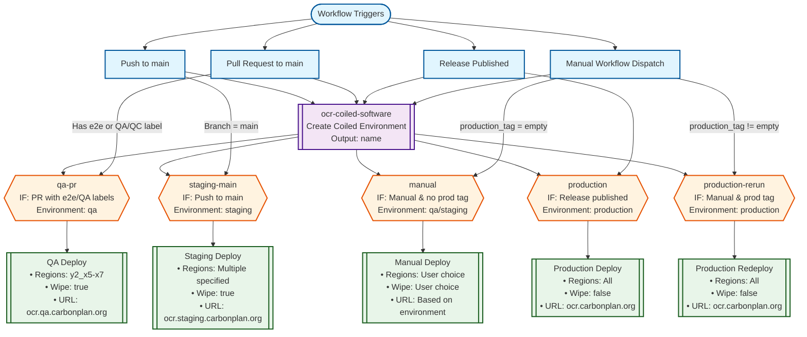

# GitHub Actions Deployment Workflow Visualization

This document visualizes the deployment workflow logic used to deploy OCR including triggers, input-based branching, and environment variable assignments.

## Mermaid Diagram

