# Deployment

This document provides a comprehensive reference for the Open Climate Risk (OCR) deployment workflow, detailing the complete pipeline from data processing through deployment automation.

## Overview

The OCR project uses a multi-stage pipeline that processes regional data, aggregates results, and generates visualization tiles. The entire workflow is orchestrated through GitHub Actions with automatic deployments to multiple environments (QA, staging, and production).

## Processing Pipeline Architecture

The OCR processing pipeline consists of three main phases, each with specific computational requirements and error handling mechanisms. The pipeline leverages Coiled for distributed computing and includes automatic retry logic for resilient processing.

### Pipeline Phases

1. **Region Processing (Phase 01)**: Distributed processing of geographic regions with automatic retry capabilities
2. **Aggregation (Phase 02)**: Data consolidation and statistical summary generation
3. **Tile Generation (Phase 03)**: Creation of PMTiles for efficient map visualization

### Pipeline Visualization

```mermaid
%%{init: {'theme':'neutral', 'themeVariables': {'primaryColor':'#2563eb','primaryTextColor':'#1f2937','primaryBorderColor':'#3b82f6','lineColor':'#6b7280','secondaryColor':'#7c3aed','tertiaryColor':'#10b981','background':'#ffffff','mainBkg':'#f3f4f6','secondBkg':'#e5e7eb','tertiaryBkg':'#d1d5db','primaryTextColor':'#111827','lineColor':'#6b7280','textColor':'#374151','mainContrastColor':'#1f2937','darkMode':false}}}%%
graph TB
    %% Start and Configuration
    Start([Start OCR Pipeline])
    CheckEnv{COILED_SOFTWARE_ENV_NAME<br/>Set?}
    Start --> CheckEnv

    CheckEnv -->|No| LogError[Log Error:<br/>Package sync warning]
    CheckEnv -->|Yes| ConfigRegions[Configure Regions<br/>select_region_ids]
    LogError --> ConfigRegions

    %% Section 01: Process Regions with Retry Logic
    subgraph Section01["<b>Phase 01 - Process Regions</b>"]
        InitAttempt[Initialize Attempt = 1]
        ConfigRegions --> InitAttempt

        ProcessRegions[["🔄 <b>process-region</b><br/>Command: ocr process-region<br/>Platform: COILED<br/>Map over: remaining regions<br/>Risk Type: specified"]]

        InitAttempt --> ProcessRegions

        CheckFailed{Any Failures?}
        ProcessRegions --> CheckFailed

        CheckRetries{Attempt ≤<br/>process_retries?}
        CheckFailed -->|Yes| CheckRetries

        IncrementAttempt[Increment Attempt<br/>Sleep: 5 * attempt seconds]
        CheckRetries -->|Yes| IncrementAttempt
        IncrementAttempt --> ProcessRegions

        RetryError[RuntimeError:<br/>Failed after max retries]
        CheckRetries -->|No| RetryError
    end

    %% Optional Pyramid Step
    CheckPyramid{--create-pyramid?}
    CheckFailed -->|No| CheckPyramid

    CreatePyramid[["🔺 <b>create-pyramid</b><br/>Command: ocr create-pyramid<br/>VM: m8g.4xlarge<br/>Scheduler: m8g.4xlarge<br/>(Optional)"]]
    CheckPyramid -->|Yes| CreatePyramid

    %% Section 02: Aggregation
    subgraph Section02["<b>Phase 02 - Aggregation</b>"]
        AggregateGeo[["📊 <b>partition-buildings</b><br/>Command: ocr partition-buildings<br/>VM: c8g.12xlarge<br/>Scheduler: c8g.12xlarge<br/>Creates GeoParquet"]]

        CheckPyramid -->|No| AggregateGeo
        CreatePyramid --> AggregateGeo

        RegionSummaryStats[["📈 <b>aggregate-region-risk-summary-stats</b><br/>Command: ocr aggregate-region-<br/>risk-summary-stats<br/>VM: m8g.16xlarge<br/>Scheduler: m8g.16xlarge"]]
        AggregateGeo --> RegionSummaryStats

        CheckWriteRegionalStats{--write-regional-stats?}
        RegionSummaryStats --> CheckWriteRegionalStats

        WriteRegionFiles[["📝 <b>write-aggregated-region-analysis-files</b><br/>Command: ocr write-aggregated-<br/>region-analysis-files<br/>VM: r8g.4xlarge<br/>Scheduler: r8g.4xlarge"]]
        CheckWriteRegionalStats -->|Yes| WriteRegionFiles

        RegionalPMTiles[["🗺️ <b>create-regional-pmtiles</b><br/>Command: ocr create-regional-pmtiles<br/>VM: c8g.12xlarge<br/>Scheduler: c8g.12xlarge<br/>Disk: 250 GB"]]
        CheckWriteRegionalStats -->|No| RegionalPMTiles
        WriteRegionFiles --> RegionalPMTiles
    end

    %% Section 03: Tiles Creation
    subgraph Section03["<b>Phase 03 - Tile Generation</b>"]
        CreateCentroidPMTiles[["📍 <b>create-building-centroid-pmtiles</b><br/>Command: ocr create-building-<br/>centroid-pmtiles<br/>VM: c8g.12xlarge<br/>Scheduler: c8g.12xlarge<br/>Disk: 250 GB"]]
        RegionalPMTiles --> CreateCentroidPMTiles

        CreateBuildingPMTiles[["🌍 <b>create-building-pmtiles</b><br/>Command: ocr create-building-pmtiles<br/>VM: c8g.12xlarge<br/>Scheduler: c8g.12xlarge<br/>Disk: 250 GB"]]
        RegionalPMTiles --> CreateBuildingPMTiles

        WaitForTiles[Wait for both tile jobs]
        CreateCentroidPMTiles --> WaitForTiles
        CreateBuildingPMTiles --> WaitForTiles
    end

    %% End States
    Success([Pipeline Complete ✓])
    WaitForTiles --> Success

    Failure([Pipeline Failed ✗])
    RetryError --> Failure

    %% Job Manager Labels
    Manager1[batch_manager_01]
    Manager2[batch_manager_pyramid_01]
    Manager3[batch_manager_aggregate_02]
    Manager4[batch_manager_write_aggregated_<br/>region_analysis_files_01]
    Manager5[batch_manager_county_<br/>aggregation_01]
    Manager6[batch_manager_county_<br/>tiles_02]
    Manager7[batch_manager_centroid_<br/>tiles_03]
    Manager8[batch_manager_building_<br/>tiles_03]

    %% Connect managers to their jobs (dotted lines for reference)
    Manager1 -.-> ProcessRegions
    Manager2 -.-> CreatePyramid
    Manager3 -.-> AggregateGeo
    Manager4 -.-> WriteRegionFiles
    Manager5 -.-> RegionSummaryStats
    Manager6 -.-> RegionalPMTiles
    Manager7 -.-> CreateCentroidPMTiles
    Manager8 -.-> CreateBuildingPMTiles

    %% Styling with theme-neutral colors
    classDef process fill:#dbeafe,stroke:#2563eb,stroke-width:2px,color:#1e40af
    classDef aggregate fill:#ede9fe,stroke:#7c3aed,stroke-width:2px,color:#5b21b6
    classDef tiles fill:#d1fae5,stroke:#10b981,stroke-width:2px,color:#047857
    classDef decision fill:#fed7aa,stroke:#ea580c,stroke-width:2px,color:#9a3412
    classDef error fill:#fee2e2,stroke:#dc2626,stroke-width:2px,color:#991b1b
    classDef manager fill:#f3f4f6,stroke:#6b7280,stroke-width:1px,stroke-dasharray: 5 5,color:#4b5563
    classDef success fill:#bbf7d0,stroke:#16a34a,stroke-width:3px,color:#14532d
    classDef optional fill:#fef9c3,stroke:#ca8a04,stroke-width:2px,color:#713f12

    class ProcessRegions process
    class CreatePyramid optional
    class AggregateGeo,WriteRegionFiles,RegionSummaryStats aggregate
    class RegionalPMTiles,CreateCentroidPMTiles,CreateBuildingPMTiles tiles
    class CheckEnv,CheckFailed,CheckRetries,CheckWriteRegionalStats,CheckPyramid decision
    class RetryError,LogError,Failure error
    class Manager1,Manager2,Manager3,Manager4,Manager5,Manager6,Manager7,Manager8 manager
    class Success success
    class Start process
    class WaitForTiles tiles
```

### Key Pipeline Features

- **Automatic Retry Logic**: Failed region processing attempts are automatically retried with exponential backoff (5 seconds × attempt number)
- **Distributed Processing**: Leverages Coiled for parallel processing across multiple regions
- **Resource Optimization**: Each job is configured with specific VM types and disk requirements optimized for its workload
- **Conditional Branching**: Optional region file writing based on deployment configuration

## Deployment Automation via GitHub Actions

The deployment workflow automates the entire release process from development through production, with built-in safeguards and environment-specific configurations.

### Deployment Environments

| Environment    | Trigger                         | Purpose                     | URL                                    |
| -------------- | ------------------------------- | --------------------------- | -------------------------------------- |
| **QA**         | PR with `e2e` or `QA/QC` labels | Testing and validation      | `ocr.qa.carbonplan.org`                |
| **Staging**    | Push to `main` branch           | Pre-production verification | `ocr.staging.carbonplan.org`           |
| **Production** | Release publication             | Live system                 | `carbonplan.org/research/climate-risk` |

### Deployment Workflow Visualization

### Workflow Features

#### Automatic Deployments

- **QA**: Triggered automatically when PRs to main include `e2e` or `QA/QC` labels
- **Staging**: Deployed automatically on every push to the main branch
- **Production**: Released automatically when a new version is published

#### Manual Controls

- **Environment Selection**: Choose between QA and staging for manual deployments
- **Region Selection**: Deploy specific regions or all regions
- **Data Management**: Option to wipe existing data before deployment
- **Production Redeployment**: Redeploy specific versions to production using semantic version tags

#### Safety Features

- **Environment Isolation**: Each environment uses separate configuration files
- **Version Tracking**: Production deployments are tagged with semantic versions
- **Concurrency Control**: Prevents simultaneous deployments to the same environment
- **Rollback Capability**: Production can be redeployed to any previous version

## Configuration Management

### Environment Variables

Each environment maintains its own configuration file:

- **QA**: `ocr-coiled-s3.env`
- **Staging**: `ocr-coiled-s3-staging.env`
- **Production**: `ocr-coiled-s3-production.env`

### Key Configuration Parameters

| Parameter                  | Description                        | Example                       |
| -------------------------- | ---------------------------------- | ----------------------------- |
| `OCR_ENVIRONMENT`          | Target deployment environment      | `qa`, `staging`, `production` |
| `OCR_VERSION`              | Semantic version (production only) | `1.2.3`                       |
| `COILED_SOFTWARE_ENV_NAME` | Coiled environment identifier      | `ocr-main`, `ocr-v1-2-3`      |

## Best Practices

1. **Testing**: Always test changes in QA before merging to main
2. **Labeling**: Use appropriate labels (`e2e`, `QA/QC`) for automatic QA deployments
3. **Versioning**: Follow semantic versioning for production releases
4. **Monitoring**: Check deployment URLs after each deployment to verify success
5. **Documentation**: Update this reference when workflow changes are made

## Troubleshooting

### Common Issues

- **Region Processing Failures**: Check retry logs; system automatically retries up to the configured limit
- **Environment Variable Missing**: Ensure `COILED_SOFTWARE_ENV_NAME` is set in GitHub Actions
- **Deployment Conflicts**: Wait for current deployment to complete; concurrency controls prevent overlaps
- **Version Mismatch**: Verify semantic version format when redeploying to production

### Support Resources

- Check deployment status at the environment URLs listed above
- Review GitHub Actions logs for detailed error messages
- Consult Coiled dashboard for distributed job execution details
