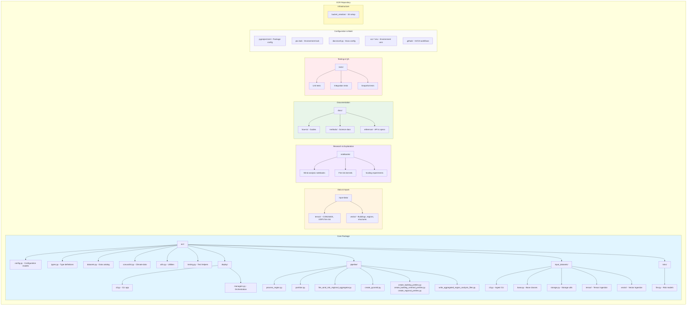

# Project structure

This page documents the Open Climate Risk (OCR) repository layout and explains the purpose of key directories and files. Use this as a technical reference when contributing code, adding datasets, or extending documentation.

---

## Repository overview

The OCR platform is organized into distinct layers: the core Python package (`ocr/`), supporting infrastructure (configuration, deployment, testing), input data management, exploratory research notebooks, and comprehensive documentation. The structure follows best practices for scientific Python projects with emphasis on reproducibility, modularity, and cloud-native execution.



---

## Core package (`ocr/`)

Contains all production code organized into logical modules:

### Top-level modules

| Module        | Purpose                                                                               |
| ------------- | ------------------------------------------------------------------------------------- |
| `config.py`   | Pydantic models for storage, chunking, Coiled, and processing configuration           |
| `types.py`    | Type definitions and enums (Environment, Platform, RiskType, RegionType)              |
| `datasets.py` | Catalog abstraction for Zarr and GeoParquet datasets in S3 storage                    |
| `conus404.py` | CONUS404 climate data helpers: load variables, compute humidity, wind transformations |
| `utils.py`    | DuckDB utilities, S3 secrets, vector sampling, file transfer helpers                  |
| `testing.py`  | Snapshot testing extensions for xarray and GeoPandas                                  |
| `console.py`  | Rich console instance for pretty terminal output                                      |

### Deployment (`deploy/`)

Orchestration layer for local and cloud execution:

- **`cli.py`** - Typer-based CLI application (`ocr` command) with commands for processing regions, aggregation, PMTiles generation, and analysis file creation
- **`managers.py`** - Abstract batch manager interface with `CoiledBatchManager` (cloud) and `LocalBatchManager` (local) implementations

### Pipeline (`pipeline/`)

Internal processing modules coordinated by the CLI. These implement the data processing workflow:

- **`process_region.py`** - Sample risk values to building locations
- **`partition.py`** - Partition GeoParquet by geographic regions
- **`fire_wind_risk_regional_aggregator.py`** - Compute regional statistics with DuckDB
- **`create_pyramid.py`** - Generate ndpyramid multiscale Zarr for web visualization
- **`create_building_pmtiles.py`** - Generate PMTiles for building footprint visualization
- **`create_building_centroid_pmtiles.py`** - Generate PMTiles for building centroid visualization
- **`create_regional_pmtiles.py`** - Generate PMTiles for regional aggregated statistics
- **`write_aggregated_region_analysis_files.py`** - Write regional summary tables for all regions

### Risk models (`risks/`)

Domain-specific risk calculation logic:

- **`fire.py`** - Fire/wind risk kernels, wind classification, elliptical spread models

### Input datasets (`input_datasets/`)

Infrastructure for ingesting and processing input datasets:

- **`cli.py`** - CLI application for dataset ingestion (`ocr ingest-data` command)
- **`base.py`** - Abstract base classes for dataset processors
- **`storage.py`** - Storage utilities for managing dataset files
- **`tensor/`** - Tensor (raster) dataset ingestion modules
- **`vector/`** - Vector (GeoParquet) dataset ingestion modules

---

## Data management (`input-data/`)

Organized storage for input datasets and ingestion scripts:

### Tensor data (`tensor/`)

- **`conus404/`** - CONUS404 climate reanalysis data (wind speed, direction, temperature, etc.)

### Vector data (`vector/`)

- **`alexandre-2016/`** - Historical fire perimeter data
- **`calfire_stuctures_destroyed/`** - Structure damage records from CalFire

:::{note}
Raw data files are typically not committed. This directory contains ingestion scripts and metadata. Large datasets are stored on S3.
:::

---

## Research notebooks (`notebooks/`)

Exploratory Jupyter notebooks for prototyping and analysis:

- `conus404-winds.ipynb` - Wind data exploration and CONUS404 analysis
- `elliptical_kernel.ipynb` - Fire spread kernel development
- `evaluating_wind_spreading.ipynb` - Wind spreading validation
- `fire-weather-wind-mode-reprojected.ipynb` - Wind mode analysis
- `wind_spread.ipynb` - Wind-driven fire spread modeling
- `wind-spreading-kernels.ipynb` - Wind spread kernel experiments
- `methods-figures.ipynb` - Generate figures for methodology documentation
- `benchmarking.ipynb` - Performance benchmarking experiments

:::{note}
**Convention**: When a notebook reaches maturity and demonstrates stable workflows, consider converting it into a how-to guide under `docs/how-to/`.
:::

---

## Documentation (`docs/`)

```text
docs/
├── how-to/                    # Task-oriented guides
├── reference/                 # Information-oriented technical specs
├── methods/                   # Explanation-oriented background
├── assets/                    # Images, stylesheets, static files
└── access-data.md             # Quick reference for downloads
└── terms-of-data-access.md    # Terms that apply to downloads
└── index.md                   # Documentation home page
```

Documentation is built with Sphinx using the sphinx-book-theme and deployed automatically to [ReadTheDocs](https://open-climate-risk.readthedocs.io/) on every PR and merge to `main`.

---

## Testing (`tests/`)

Comprehensive test suite with unit and integration tests:

| File                         | Purpose                                               |
| ---------------------------- | ----------------------------------------------------- |
| `conftest.py`                | Pytest fixtures and configuration                     |
| `test_config.py`             | Configuration model validation                        |
| `test_conus404.py`           | CONUS404 data loading and transformations             |
| `test_datasets.py`           | Dataset catalog and access patterns                   |
| `test_managers.py`           | Batch manager orchestration logic                     |
| `test_utils.py`              | Utility function tests                                |
| `test_pipeline_snapshots.py` | Snapshot-based integration tests for pipeline outputs |
| `risks/`                     | Risk model tests                                      |

**Test execution:**

```bash
pixi run tests              # Unit tests only
pixi run tests-integration  # Integration tests (may require S3 access)
```

---

## Configuration files

### Package and environment

- **`pyproject.toml`** - Project metadata, dependencies (managed by Pixi), build config, tool settings (ruff, pytest, coverage)
- **`pixi.lock`** - Locked dependency versions for reproducible environments
- **`environment.yaml`** - Conda environment export (auto-generated from Pixi for Coiled deployments)

### Documentation

- **`docs/conf.py`** - Sphinx configuration: theme, extensions, intersphinx mappings
- **`.readthedocs.yaml`** - ReadTheDocs build configuration

### Environment templates

- **`ocr-local.env`** - Template for local development (uses local filesystem)
- **`ocr-coiled-s3.env`** - Template for cloud execution (S3 backend)
- **`ocr-coiled-s3-staging.env`** - Staging environment configuration
- **`ocr-coiled-s3-production.env`** - Production environment configuration

### Code quality

- **`.pre-commit-config.yaml`** - Pre-commit hooks for linting and formatting
- **`.prettierrc.json`** - Prettier configuration for Markdown/YAML formatting
- **`codecov.yml`** - Code coverage reporting configuration

---

## Infrastructure (`bucket_creation/`)

Helper scripts for cloud infrastructure setup:

- **`create_s3_bucket.py`** - Script to create and configure S3 buckets with appropriate permissions and lifecycle policies

---

## CI/CD (`.github/`)

GitHub Actions workflows for automated testing, building, and deployment:

- **`workflows/`** - CI/CD pipeline definitions (tests, linting, docs deployment, releases)
- **`scripts/`** - Helper scripts for environment export and Coiled software creation
- **`dependabot.yaml`** - Automated dependency updates configuration
- **`release-drafter.yml`** - Automated release notes generation

---

## Development workflows

### Adding new code

1. **Create module** under `ocr/` (or in appropriate subpackage)
2. **Add tests** under `tests/` (unit tests are required, integration tests for complex scenarios)
3. **Update documentation**:
    - Add how-to guide if introducing new user-facing workflow
    - Update API reference if adding public functions/classes
    - Add method explanation if introducing new scientific approach

### Adding new datasets

1. **Create ingestion script** under `input-data/tensor/` or `input-data/vector/`
2. **Register dataset** in `ocr.datasets` catalog with metadata
3. **Document provenance**: Add new source information to `docs/reference/data-sources.md`
4. **Document ingestion** Add information to `docs/how-to/input-dataset-ingestion.md`
5. **Document workflow** Add information to `docs/how-to/work-with-input-datasets.md`

### Updating documentation

1. **Choose appropriate section** based on Diátaxis framework:
    - How-to guides: task-oriented, assume prior knowledge
    - Reference: information-oriented, technical specifications
    - Methods: explanation-oriented, scientific background
2. **Update navigation** in `docs/index.md` toctree if adding new top-level pages
3. **Test locally**: `pixi run docs-build && pixi run docs-serve` to preview changes
4. **Submit PR**: Documentation builds are tested in ReadTheDocs (PR preview link will be posted)

### Release workflow

See `docs/how-to/release-procedure.md` for detailed release instructions.
